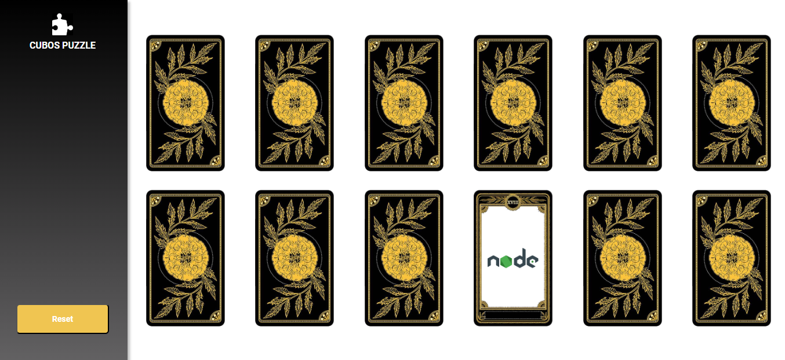

<h2 align="center"> 
	🚧 Jogo da memória 🚧
</h2>

<p align="center">
		
</p>

<p align="center">
 <a href="#sobre">Sobre</a> •
 <a href="#funcionalidades">Funcionalidades</a> •
 <a href="#layout">Layout</a> • 
 <a href="#como-executar">Como executar</a> • 
 <a href="#tecnologias">Tecnologias</a> • 
 <a href="#como-contribuir">Como contribuir</a> • 
 <a href="#autor">Autor</a> • 
</p>


## 💻 Sobre o projeto <p id="sobre"/>

📄 É um simples jogo da memória, feito enquanto eu aprendia "Estados" em React.js


Projeto desenvolvido no curso de  [Desenvolvimento de Software](https://cubos.academy/cursos/desenvolvimento-de-software) oferecido pela [Cubos Academy](https://cubos.academy/).

---

## ⚙️ Funcionalidade <p id="funcionalidades"/>

- [x] Funcionalidade 1: Ao clicar sobre uma das cartas, esta será virada. Ao clicar numa segunda carta, caso ambas sejam idênticas, elas desaparecerão da tela. Caso sejam diferentes, serão desviradas novamente.
- [x] Funcionalidade 2: Ao clicar no botão "Reset", o jogo recomeça.
- [x] Funcionalidade : Ao concluir o jogo, uma mensagem de parabenização é impressa na tela.

---

## 🎨 Layout <p id="layout"/>

O layout da aplicação está disponível no Figma:

<a href="https://www.figma.com/file/JPQXomZFaNQ5EDZc83IiyA/figma?type=design&node-id=0-1&mode=design&t=nsYNiQ5dCCq5Jx5n-0">
  
</a>


### Web

<p align="center" style="display: flex; align-items: flex-start; justify-content: center;">
  
</p>

---

## 🛣️ Como executar o projeto <p id="como-executar"/>

Este projeto é apenas de Frontend (pasta web).

### Pré-requisitos

Antes de começar, você vai precisar ter instalado em sua máquina as seguintes ferramentas:
[Git](https://git-scm.com), [Node.js](https://nodejs.org/en/). 
Além disto é bom ter um editor para trabalhar com o código como [VSCode](https://code.visualstudio.com/)


#### 🧭 Rodando a aplicação web (Frontend)

```bash

# Clone este repositório
$ git clone git@github.com:Marcelo-Siriaki/memory-game.git

# Acesse a pasta do projeto no seu terminal/cmd
$ cd memory-game

# Instale as dependências
$ npm install

# Execute a aplicação em modo de desenvolvimento
$ npm run start

# A aplicação será aberta na porta:3000 - acesse http://localhost:3000

```

---

## 🛠 Tecnologias <p id="tecnologias"/>

As seguintes ferramentas foram usadas na construção do projeto:

#### **Website**  ([React](https://reactjs.org/)  +  [JavaScript](https://www.javascript.com/))
> Veja o arquivo  [package.json](https://github.com/Marcelo-Siriaki/memory-game/blob/160785dcd59cf72de0683fac0929880cd3a68ed8/package.json)
-   Protótipo:  **[Figma](https://www.figma.com/)**  →  **[Protótipo](https://www.figma.com/file/JPQXomZFaNQ5EDZc83IiyA/figma?type=design&node-id=0-1&mode=design&t=nsYNiQ5dCCq5Jx5n-0)**
-   Editor:  **[Visual Studio Code](https://code.visualstudio.com/)**
-   Ícones:  **[Feather Icons](https://feathericons.com/)**,  **[Font Awesome](https://fontawesome.com/)**
-   Fontes:  **[Roboto](https://fonts.google.com/specimen/Roboto)**


---

## 💪 Como contribuir para o projeto <p id="como-contribuir"/>

1. Faça um **fork** do projeto.
2. Crie uma nova branch com as suas alterações: `git checkout -b my-feature`
3. Salve as alterações e crie uma mensagem de commit contando o que você fez: `git commit -m "feature: My new feature"`
4. Envie as suas alterações: `git push origin my-feature`
> Caso tenha alguma dúvida confira este [guia de como contribuir no GitHub](./CONTRIBUTING.md)

---

## 🧙‍♂️ Autor <p id="autor"/>

<a href="https://www.linkedin.com/in/msiriaki/">
 
 <br />
 <sub><b>Marcelo Siriaki Rodrigues</b></sub></a>
 <br />

---
[Entre em contato!](https://www.linkedin.com/in/msiriaki/)

